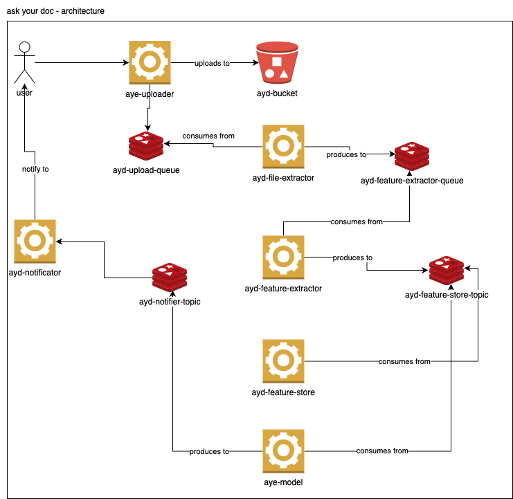

# Ask Your Doc!


## Architecture Diagram



> Ask Your Doc! is a portfolio project for my machine learning engineer career, that consists in just upload a document with a bunch of questions and return the answers by a DQA pre-trained model.

### updates and improvements

The project still in development and the next updates will be coded in the following tasks:
- [ ] Development setup (docker-compose, minio, redis and workers)
- [ ] uploader and feature extractor workers

## 💻 pre-requisites

Before start, verify if you have the following things installed:
- Docker and docker-compose
- Go (I'm using 1.22.4)
- Make

## 🚀 installing

For install from source, first you need:

- clone repository
```sh
git clone https://github.com/roqueando/askyourdoc.git
```

- build workers (for now just have uploader)
```sh
make build module=uploader
```

## ☕using

This project is like a bunch of workers sending and consuming data from queues and pubsub, so for this, just up the containers:
```sh
docker-compose up -d
```
